# GODOT -> Itch.io -> Workflow Template

## How To Use

### 1. Create Repo Using Template

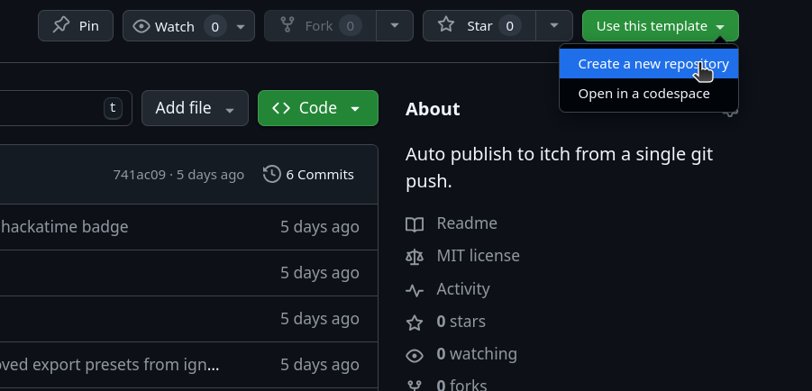

---

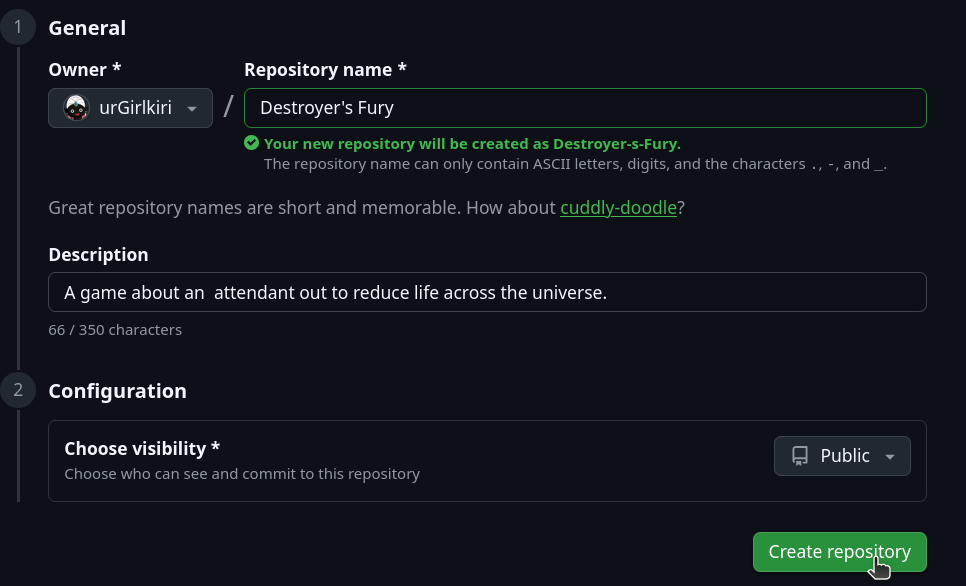
### 2. Get Itch.io Secret

#### 1. Goto Settings

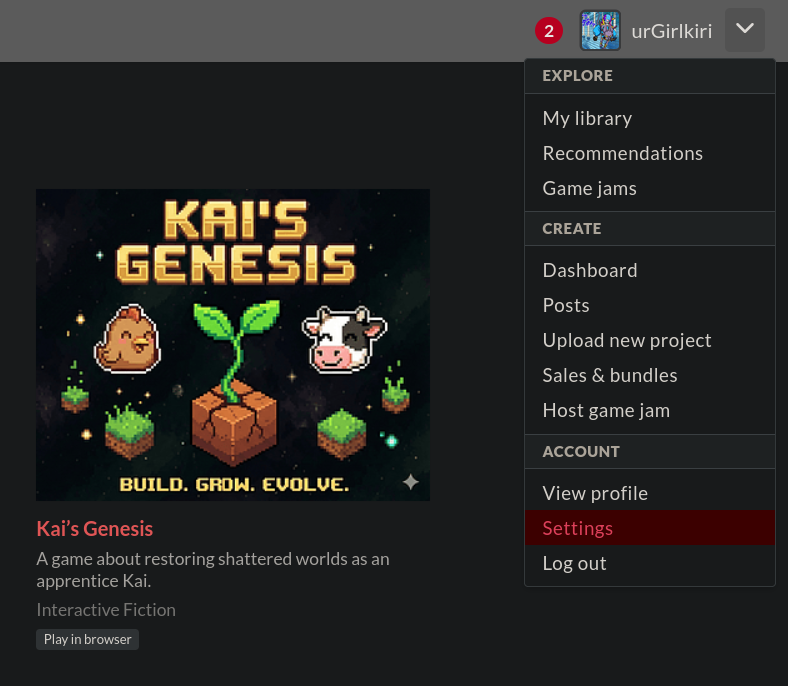

#### 2. Find API Keys

#### 3. Gen New Key

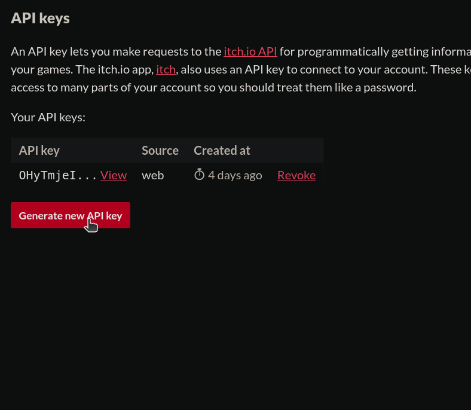

#### 4. View and Copy

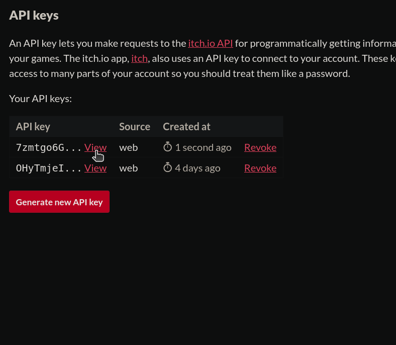

### 3. Add Secret to Github

#### 1. Goto Repo Settings

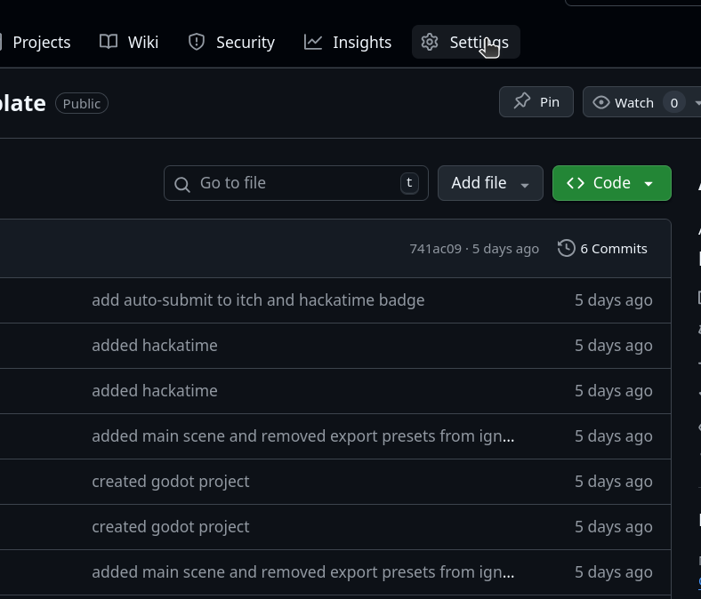

#### 2. Click Secret & Variables

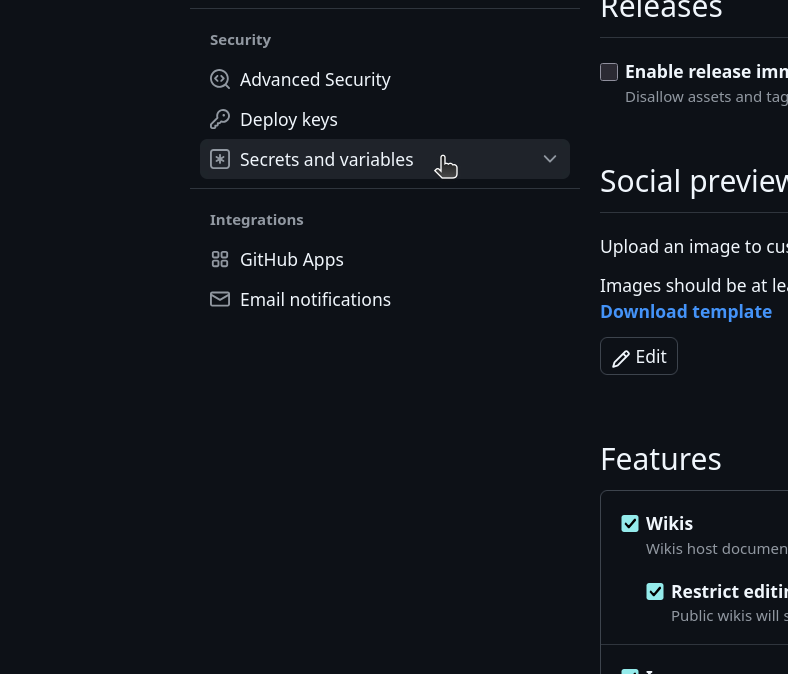

####  3. Click Actions

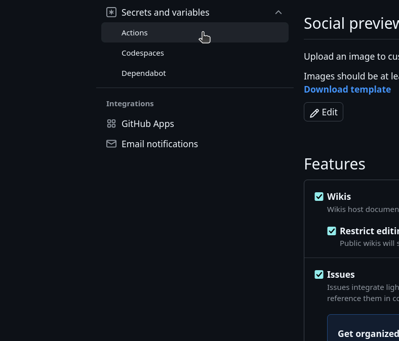

####  4. New Repo Secret

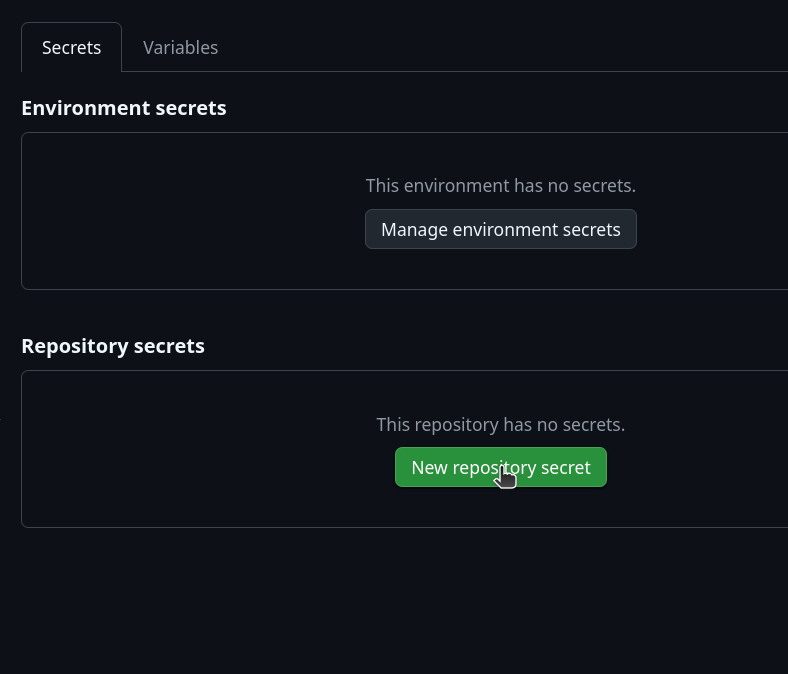

#### 4. The Repo Secrets

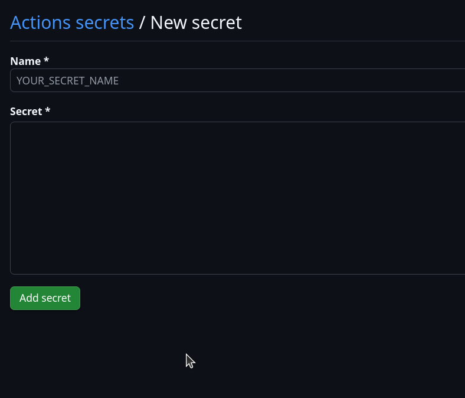

#### 5. Paste Secret & Add

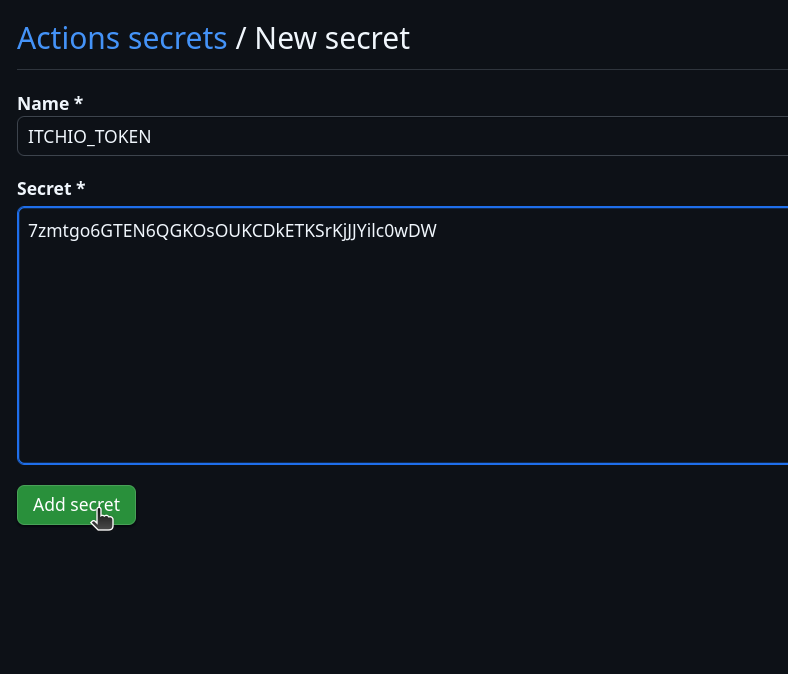

---

### 4. [Create Itch Project](https://itch.io/game/new)

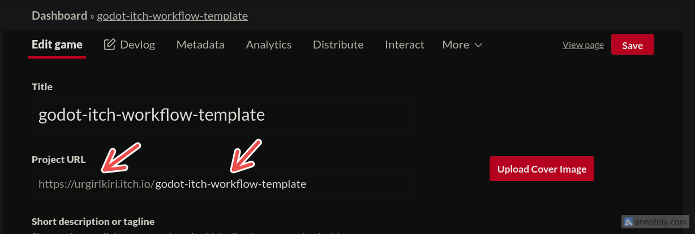

### 5. Edit Username & Project Name

## 1.  [Open The Workflow File](.github/workflows/itchio-publish.yml)

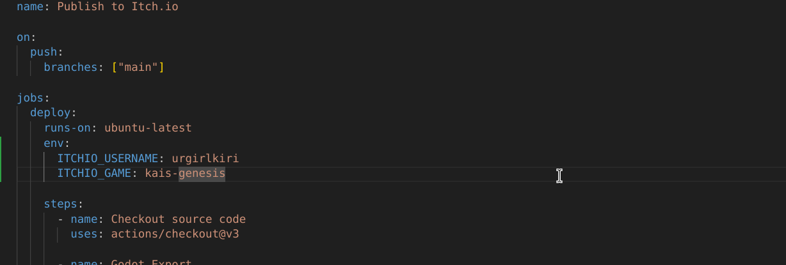

## 2. Replace With Your Details

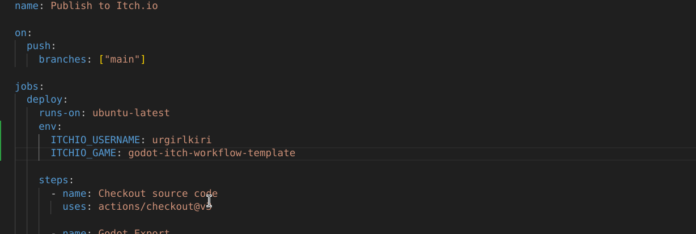

### 6. Toggle Project Settings on Itch.io

#### 1. Goto Project on Itch.io

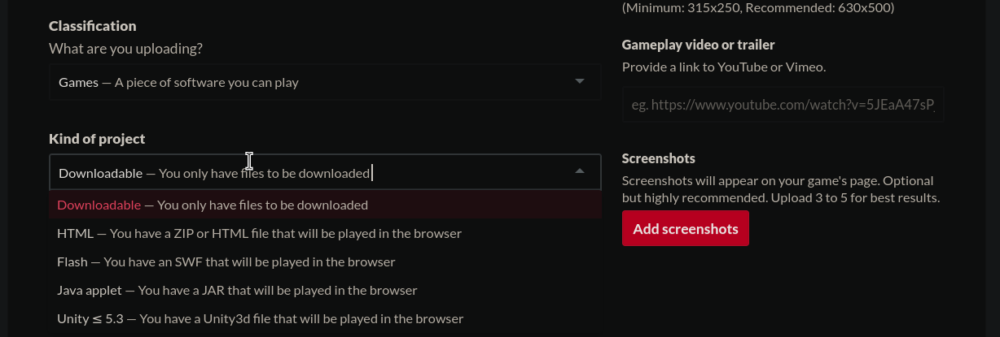

#### 2. Change Kind of project to Web

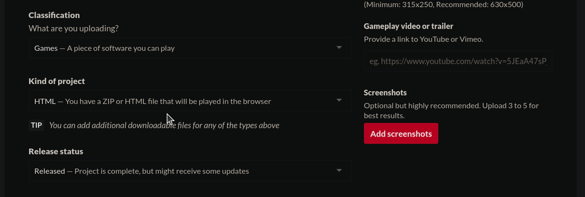

#### 3. Save Changes !!!!!!!!!!!!!!!!!!!!!!!!!!!!

### 7. Git Push 

#### 1. Commit

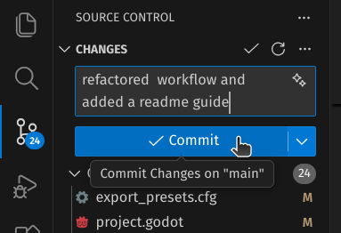

#### 2. Push

## Success

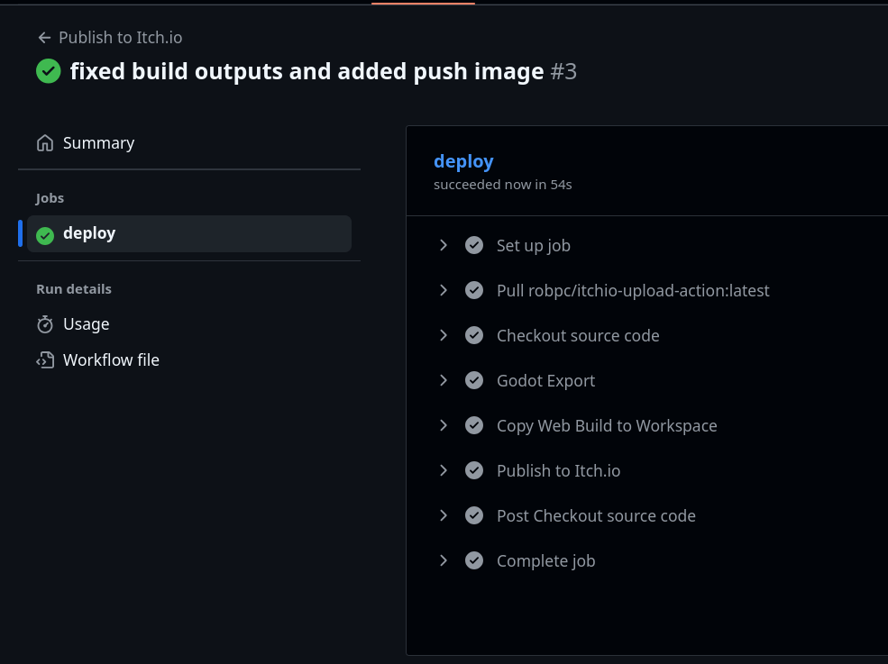

## Playable
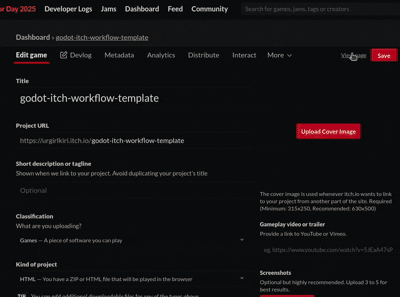

## Best Practice

>  Create a branch called dev and push to main when you're ready for a release!